# Домашнє завдання до Теми 4. DML та DDL команди. Складні SQL вирази

- Вітаємо! Час для домашнього завдання 😉

- У цьому домашньому завданні ви матимете можливість застосувати отримані знання з мови SQL для **створення та роботи з базою даних**.

- Завдання розкриє процес **визначення структури таблиць за допомогою DDL-команд**, наповнення їх тестовими даними **за допомогою DML-команд**.

- Воно також сприятиме отриманню **навичок написання складних запитів з використанням декількох операторів JOIN** для об'єднання таблиць.

### Підготовка та завантаження домашнього завдання

1. Створіть публічний репозиторій `goit-rdb-hw-04`.
2. Виконайте завдання та відправте у свій репозиторій скриншоти створених таблиць, запитів і результатів, а також текст SQL коду та відповіді на запитання в текстовому файлі.
3. Завантажте скриншоти і текстовий файл на свій комп’ютер та прикріпіть їх в LMS архівом. Назва архіву повинна бути у форматі ДЗ4_ПІБ.
4. Прикріпіть посилання на репозиторій `goit-rdb-hw-04` та відправте на перевірку.

### Формат здачі

- Прикріплені файли репозиторію архівом із назвою ДЗ4_ПІБ.
- Посилання на репозиторій.

### ВАЖЛИВО

- Будь ласка, пронумеровуйте скріншоти, щоб менторам було зрозуміло, до якого етапу ДЗ відноситься кожний з них. Наприклад, якщо файл відноситься до пункту 3, то назва файла має починатися так: p3\_.

## Опис домашнього завдання

1. Створіть базу даних для керування бібліотекою книг згідно зі структурою, наведеною нижче. Використовуйте DDL-команди для створення необхідних таблиць та їх зв'язків.

#### Структура БД

a) Назва схеми — “LibraryManagement”

b) Таблиця "authors":

- author_id (INT, автоматично зростаючий PRIMARY KEY)
- author_name (VARCHAR)

c) Таблиця "genres":

- genre_id (INT, автоматично зростаючий PRIMARY KEY)
- genre_name (VARCHAR)

d) Таблиця "books":

- book_id (INT, автоматично зростаючий PRIMARY KEY)
- title (VARCHAR)
- publication_year (YEAR)
- author_id (INT, FOREIGN KEY зв'язок з "Authors")
- genre_id (INT, FOREIGN KEY зв'язок з "Genres")

e) Таблиця "users":

- user_id (INT, автоматично зростаючий PRIMARY KEY)
- username (VARCHAR)
- email (VARCHAR)

f) Таблиця "borrowed_books":

- borrow_id (INT, автоматично зростаючий PRIMARY KEY)
- book_id (INT, FOREIGN KEY зв'язок з "Books")
- user_id (INT, FOREIGN KEY зв'язок з "Users")
- borrow_date (DATE)
- return_date (DATE)

2. Заповніть таблиці простими видуманими тестовими даними. Достатньо одного-двох рядків у кожну таблицю.

3. Перейдіть до бази даних, з якою працювали у темі 3. Напишіть запит за допомогою операторів FROM та INNER JOIN, що об’єднує всі таблиці даних, які ми завантажили з файлів: order_details, orders, customers, products, categories, employees, shippers, suppliers. Для цього ви маєте знайти спільні ключі. Перевірте правильність виконання запиту.

4. Виконайте запити, перелічені нижче.

- Визначте, скільки рядків ви отримали (за допомогою оператора COUNT).
- Змініть декілька операторів INNER на LEFT чи RIGHT.
- Визначте, що відбувається з кількістю рядків. Чому? Напишіть відповідь у текстовому файлі.
- Оберіть тільки ті рядки, де employee_id > 3 та ≤ 10.
- Згрупуйте за іменем категорії, порахуйте кількість рядків у групі, середню кількість товару (кількість товару знаходиться в order_details.quantity)
- Відфільтруйте рядки, де середня кількість товару більша за 21.
- Відсортуйте рядки за спаданням кількості рядків.
- Виведіть на екран (оберіть) чотири рядки з пропущеним першим рядком.

### Критерії прийняття

1. Прикріплені посилання на репозиторій goit-rdb-hw-04 та безпосередньо самі файли репозиторію архівом.
2. Створено базу даних з необхідною структурою.
3. Таблиці заповнено тестовими даними.
4. SQL команди до кожного пункту чи підпункту виконуються і дають очікуваний результат (створюють таблиці чи роблять певні операції з даними).
5. Правильно дані відповіді на запитання в 4-му пункті.

### Результат виконаного ДЗ

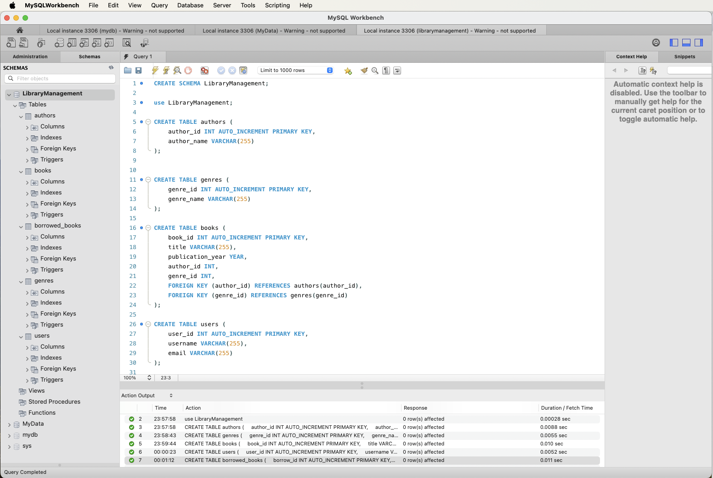

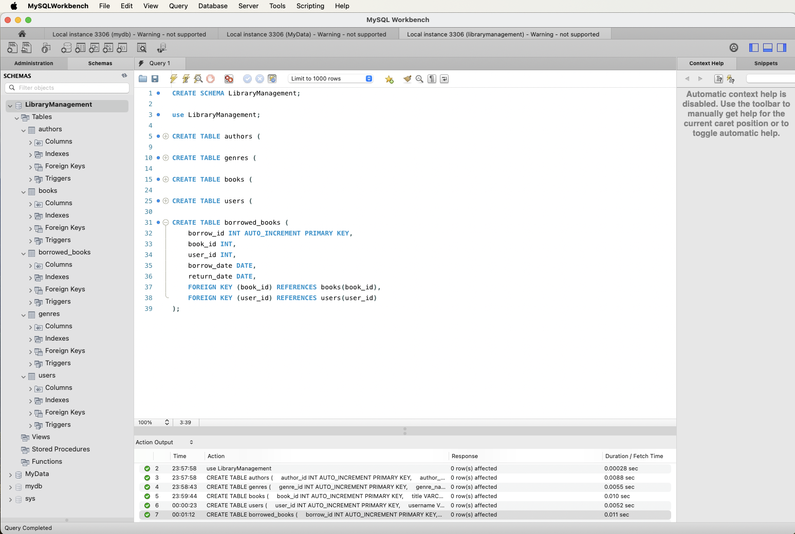

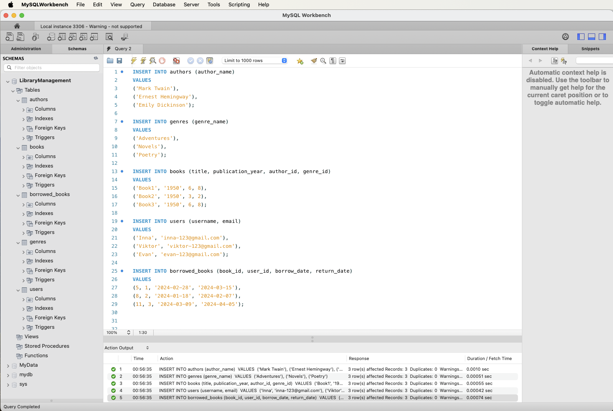

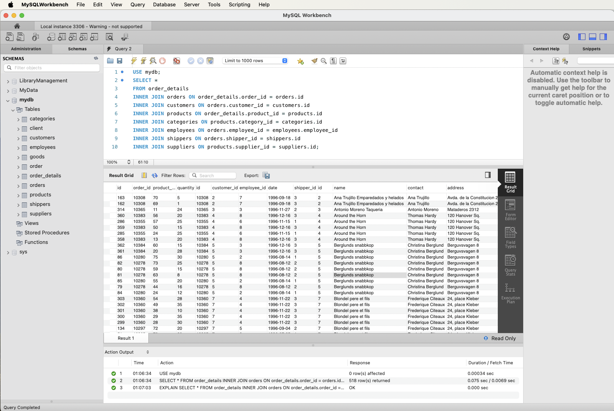

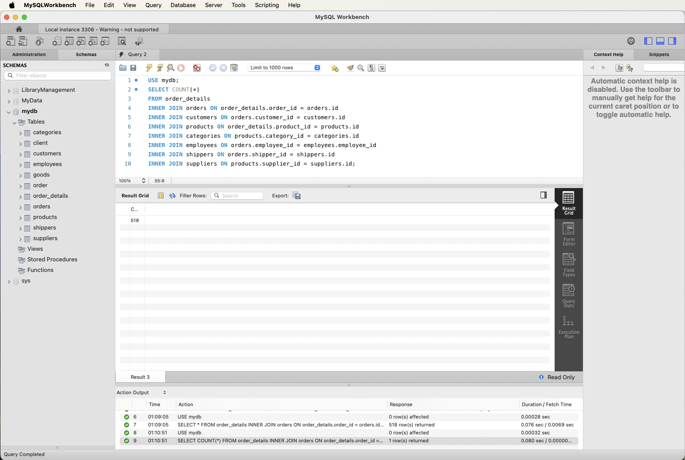

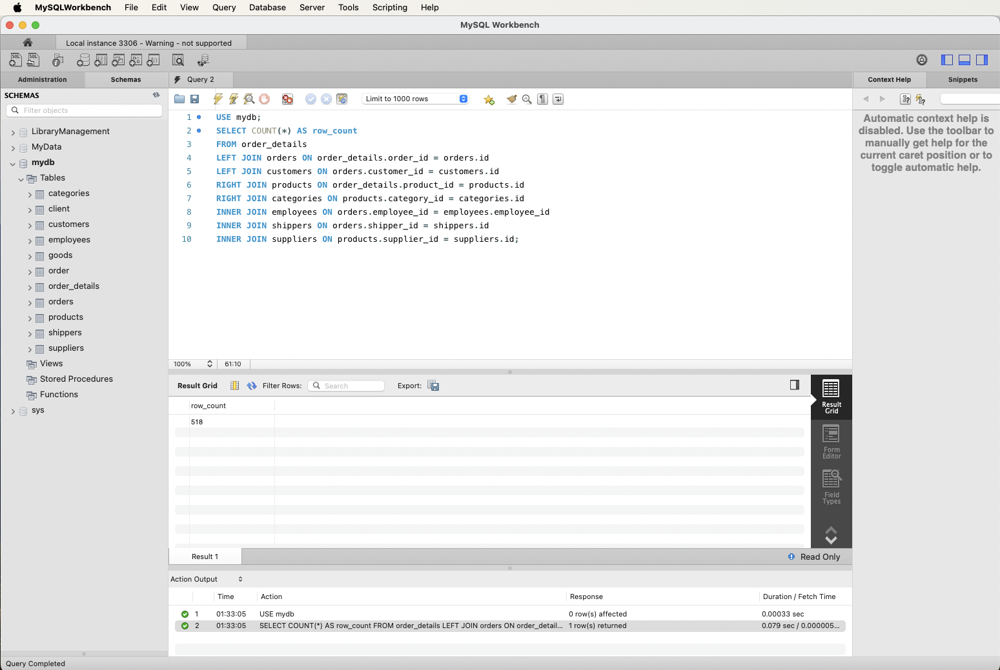

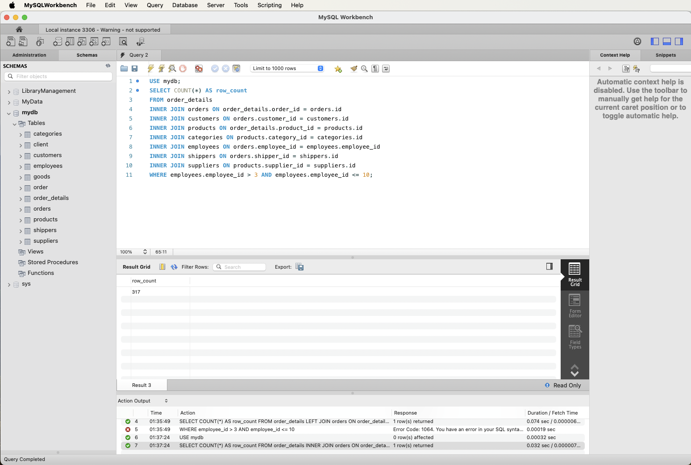

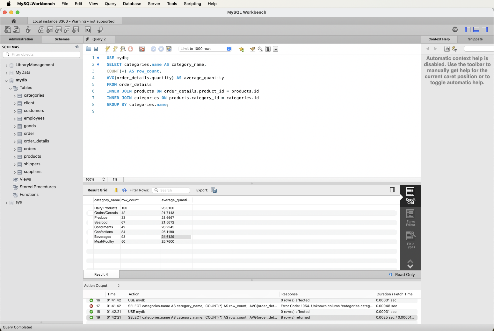

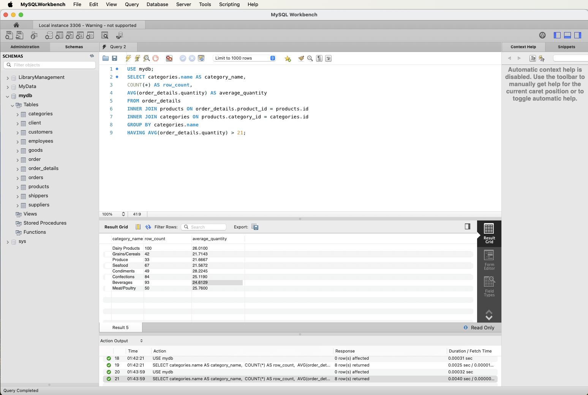

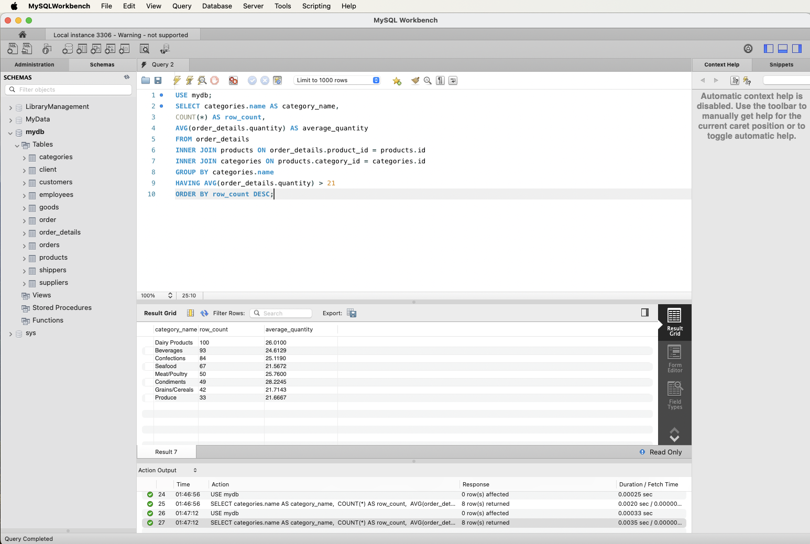

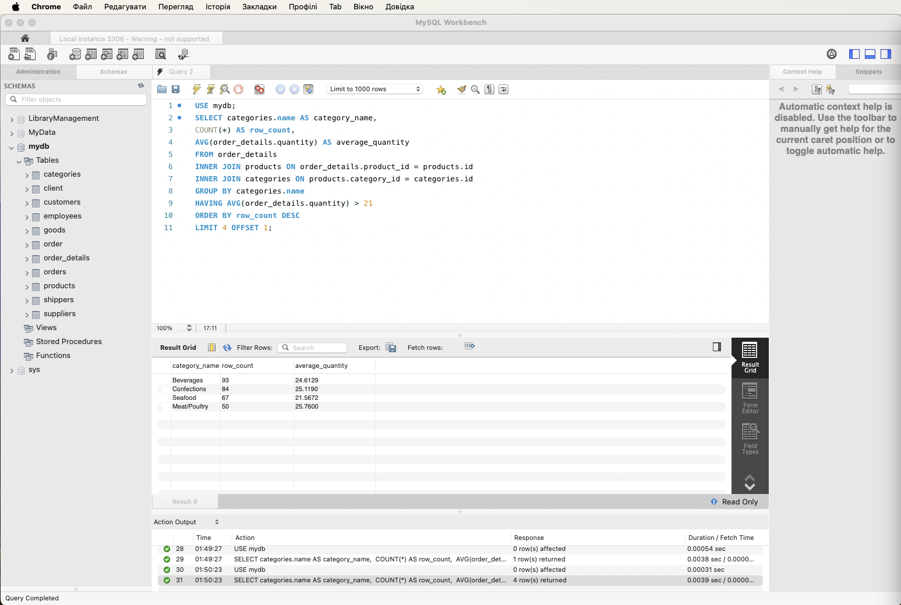
